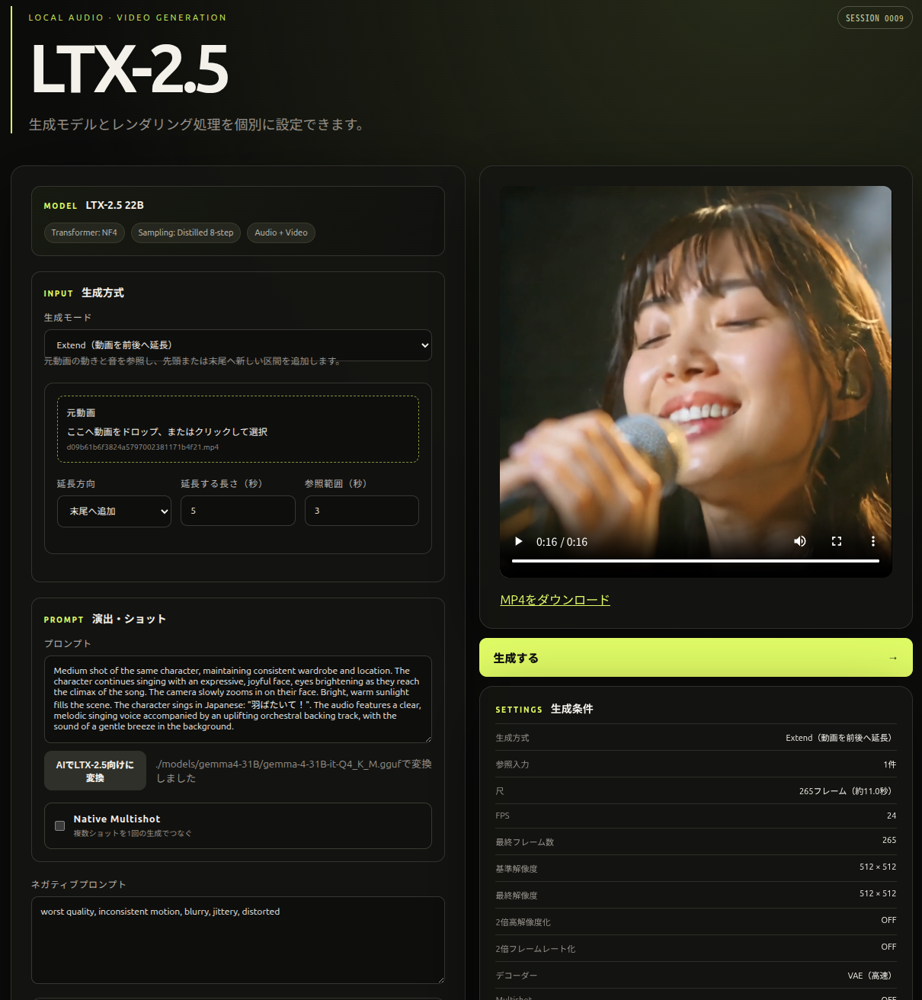

# LTX-2.5 Diffusers Server + Web UI

[English](README_EN.md) | 日本語

`Lightricks/LTX-2.5-Diffusers`で、音声付き動画を生成するローカルWebアプリです。FastAPIの非同期ジョブAPIとWeb UIを同じプロセスで提供します。T2AV、I2V、先頭／末尾フレーム指定（FLF2V）、任意の画像／動画条件に対応します。既定の高品質モードは、初段の潜在出力を2倍アップサンプルし、追加の3-stepで精細化します。

## UIサンプル



## 事前準備

- NVIDIA GPU、対応するドライバー、十分なRAM/VRAM
- Python 3.11以上、またはDocker + NVIDIA Container Toolkit
- `ffmpeg`
- Hugging Faceで[モデルページ](https://huggingface.co/Lightricks/LTX-2.5-Diffusers)の利用条件に同意したアカウントのRead token

このモデルは約190億パラメータで、リポジトリ全体の保存容量も非常に大きいため、初回ダウンロードには時間とディスク空き容量が必要です。既定の`model`オフロードはVRAMを抑える代わりに推論が遅くなります。

## 順次ダウンロード・NF4量子化

巨大コンポーネントを同時に保持しないスクリプトを先に実行します。各コンポーネントは専用キャッシュへ取得され、NF4保存物または追加チェックポイントの再ロード検証に成功した場合だけ、そのキャッシュが削除されます。中断後は同じコマンドで再開できます。LTX-2.5本体に加えて、[Pixel Spatial Upscaler IC-LoRA](https://huggingface.co/Lightricks/LTX-2.5-22b-IC-LoRA-Pixel-Spatial-Upscaler)の利用条件にも事前に同意してください。

```bash
docker build -t ltx25-server .
docker run --rm --gpus 'device=0' \
  -v "$PWD:/app" \
  -v "$HOME/.cache/huggingface:/root/.cache/huggingface:ro" \
  -w /app ltx25-server \
  python scripts/download_quantize_ltx25.py
```

既定では処理開始時の空きが80GiBを下回ると停止します。高品質生成用の潜在アップサンプラーと公式Pixel Spatial Upscaler IC-LoRAを取得しますが、`transformer_full`、任意のユーザーLoRA、diffusion decoderは取得しません。既存環境へPixel IC-LoRAだけ追加する場合は`python scripts/download_quantize_ltx25.py --component pixel_upscaler`を実行します。

## Dockerで起動

```bash
cp .env.example .env
# .env の HF_TOKEN を設定
docker compose up --build
```

ブラウザーで <http://localhost:8000> を開きます。

## Python環境で起動

```bash
python -m venv .venv
source .venv/bin/activate
pip install -r requirements.txt
cp .env.example .env
# .env の HF_TOKEN を設定
uvicorn app.main:app --host 0.0.0.0 --port 8000
```

API仕様は <http://localhost:8000/docs> で確認できます。

## 生成モード

- `t2av`: テキストから音声付き動画
- `i2v`: 1枚の先頭画像から音声付き動画
- `flf2v`: 先頭画像と末尾画像を両方固定した補間動画
- `condition`: 最大8個の画像／動画を任意の潜在フレーム位置と強度で指定
- `t2i`: プロンプトから静止画1枚（蒸留2段生成 → 2倍解像度PNG）
- `refine_image`: 入力画像の2倍解像度再解釈／バリエーション静止画
- `ref2i`: 参照画像の同一性を保った新しい場面の静止画

Web UIでは生成方式とレンダリングを個別に指定します。横長は768×512、768×448、960×544、1280×704、1920×1088、縦長はそれらを転置した512×768、448×768、544×960、704×1280、1088×1920、正方形は512×512を選択できます。`2倍高解像度化`はT2AV、I2V、FLF2V、Reference条件で利用でき、最大960×544（縦長は544×960）の基準サイズから1920×1088（1088×1920）を出力します。方式は、従来のlatent 2倍アップスケールと3-step refineを行う`Latent Upscale`と、初段の低解像度映像を参照latentとして公式IC-LoRAで細部を再生成する`Pixel IC-LoRA`から選択します。Pixel方式は構図・動き・被写体を参照しますが、存在しない高周波ディテールを創作するためピクセル忠実な拡大ではありません。APIでは`upscale_method=latent/pixel`を指定します。1280×704以上のプリセットはVRAM消費が大きい直接生成専用で、選択すると2倍高解像度化は解除されます。OFFの場合は8-step単段生成です。I2V/FLF2Vの先頭画像を選ぶと、Web UIが画像の縦横比に合わせて標準基準サイズを自動選択します。APIの`quality=high/draft`は後方互換用に残っていますが、新規クライアントは`upscale=true/false`を使用してください。

`2倍フレームレート化`は独立して選択できます。Temporal Latent Upscale と3-step refineにより、121フレーム/24fpsを241フレーム/48fpsへ変換し、動画と音声の尺は維持します。APIでは`temporal_upscale=true`を指定します。空間・時間の両方を選んだ場合もrefineは1回です。初回セットアップ済み環境では `scripts/download_quantize_ltx25.py --component temporal` を一度実行してください。

`Retake`では元動画と開始・終了秒を指定し、選択した時間領域だけをlatent上で再生成します。元動画のFPSと解像度は自動取得され、範囲外の映像・音声は維持されます。映像のみ、音声のみ、または両方の再生成を選択できます。元動画は8n+1フレームかつ縦横32の倍数である必要があります。

`Extend`では元動画の先頭または末尾へ1〜20秒の新しい映像・音声を追加します。参照範囲をclean latentのprefix/suffixとして固定するため、境界の被写体・動作・構図を引き継ぎます。元動画のFPSと解像度は自動採用され、参照範囲と延長範囲は8フレーム単位へ調整されます。1回の生成に使う参照＋延長は最大481フレームです。

### 静止画モード（t2i / refine_image / ref2i）

動画パイプラインを流用して静止画PNGを生成する3モードです（レシピは`scratch_t2i_probe/`の実証プローブに基づく）。出力は`outputs/t2i_*.png`／`refine_*.png`／`ref2i_*.png`へ保存され、履歴DBには`image_url`として記録されます（MP4は作成しません）。LoRA合成・シード・進捗・キューは動画モードと同様に機能します。

- **`t2i`**: `num_frames=9`固定・蒸留2段（8σ → 2x latent upsample → 3σ refine）・VAEデコードで、基準解像度の2倍（既定512²→1024²）の中央フレームをPNG化します。`decoder: "diffusion"`を指定した場合のみ、NATTENカーネルの最小サイズ制約（kernel 11×11×11 > 9フレーム）を満たすため内部で`num_frames`を17へ昇格し（ログに明示）、diffusion decoderでデコードします。
- **`refine_image`**: 入力画像（`/api/assets`で登録、`conditions`の`index: 0`に指定）を条件に、t2iと同じ2段レシピで2倍解像度に再解釈します。`strength`（0.1〜1.0、既定1.0）で参照の効きを調整します。デコードはVAE固定です。strength=1.0の実測で入力とのmean abs diffは約0.099（プローブP6と一致）。
- **`ref2i`**: 参照画像1〜複数（`conditions`スキーマ流用、各latent index／strength指定可）＋場面プロンプトから、30-step基本スケジュール（guidance 3.0）で短い内部動画を生成し、`frame_position: "last"`（既定）または`"center"`のフレームをPNG化します。`num_frames`は25/41/49（既定49、参照から離れた場面ほど大きい値が有効）。デコードはVAE固定で、`decoder: "diffusion"`を指定しても警告ログ付きでVAEへフォールバックします（画像条件×diffusion decoderはブラーする実証結果のため）。

```bash
# t2i（既定: 512²基準 → 1024² PNG）
curl -X POST http://localhost:8000/api/jobs -H 'content-type: application/json' \
  -d '{"mode":"t2i","prompt":"A photorealistic portrait, golden hour light","width":512,"height":512,"seed":42}'

# refine_image（入力画像の2x再解釈）
curl -X POST http://localhost:8000/api/jobs -H 'content-type: application/json' \
  -d "{\"mode\":\"refine_image\",\"prompt\":\"...\",\"width\":512,\"height\":512,\"strength\":1.0,\"conditions\":[{\"asset_id\":\"$ASSET_ID\",\"kind\":\"image\",\"index\":0}]}"

# ref2i（参照→新場面の静止画、末尾フレーム抽出）
curl -X POST http://localhost:8000/api/jobs -H 'content-type: application/json' \
  -d "{\"mode\":\"ref2i\",\"prompt\":\"The same woman, new scene...\",\"width\":512,\"height\":512,\"num_frames\":49,\"frame_position\":\"last\",\"conditions\":[{\"asset_id\":\"$ASSET_ID\",\"kind\":\"image\",\"index\":0,\"strength\":1.0}]}"
```

実測（RTX PRO 6000 Blackwell 96GB、`OFFLOAD_MODE=model`、512²基準、seed=42）: t2i 46.5s（初回モデルロード込み。ロード後の生成本体は約6〜8s）／ピークVRAM 17.9GB、t2i+diffusion decoder 約30s（ウォーム）、refine_image 30.0s（ウォーム）、ref2i nf=49 45.5s（ウォーム、denoise約34s）。Web UIでは3モードをモード選択から使え、結果はギャラリーにPNGタイルで表示（ダウンロード可）、「この画像を I2V/FLF2V の先頭画像に使う」ボタンで生成PNGをそのままI2Vの先頭画像欄へセットできます。

`Audio → Video`ではWAV/MP3/M4A/FLAC/OGG/AACをAudio VAEでlatent化し、音声モダリティを固定したまま映像だけを生成します。音声開始位置と最大20秒の使用時間を指定でき、任意の先頭画像も併用できます。出力にはVAE再構成音ではなく元の入力波形を使用します。

Web UIは自動尺（duration head）、Native Multishot用のショットエディタ、セッション番号付き生成履歴に対応します。履歴は既定で`outputs/history.sqlite3`に永続化されます。自動尺でReference条件を使う場合、出力尺が生成前に未確定のため、参照の配置位置は先頭（0%）または末尾（100%）に限定されます。

LoRAは`loras/`直下へ`.safetensors`を配置し、Web UIの「再読込」から選択します。1ジョブにつき最大4本を合成でき、各強度は-2.0〜2.0です。ジョブ終了時（失敗時を含む）にadapterをアンロードするため、次の生成へ設定は持ち越されません。LTX-2/LTX-2.5のDiffusers transformer互換LoRAを使用してください。旧LTX-Video用やComfyUI固有キーのLoRAは変換なしではロードできない場合があります。

`IC-LoRA / Reference`は通常のReference条件とは別の専用モードです。IC-LoRAを1本と参照シート画像または参照動画を指定し、参照latentを生成列へ追加トークンとして連結します。画像は出力フレーム数と同じ長さの静止参照動画へ内部変換されます。汎用経路はstage 1のみ、固定尺、推奨768×448です。HDRのscene embedding、DubItの音声参照など追加入力を要求する専用IC-LoRAには対応しません。

一覧APIはsafetensorsメタデータの`model_version`と`reference_downscale_factor`を読み取ります。現在の汎用IC-LoRAモードは参照縮小率1のみ対応し、それ以外はUIで生成前に拒否します。

`AIでLTX-2.5向けに変換`はOpenAI互換の`/chat/completions`を使用します。`.env`に`LLM_BASE_URL`と`LLM_MODEL`を設定し、必要な場合は`LLM_API_KEY`も設定してください。未設定でも通常の生成機能は利用できます。

Web UIでモードを選び、条件ファイルをアップロードして生成できます。APIでは先にアセットを登録し、返却された32桁の`id`を生成リクエストで使います。

```bash
# I2V
ASSET_ID=$(curl -s -F 'file=@first.png' http://localhost:8000/api/assets \
  | python -c 'import json,sys; print(json.load(sys.stdin)["id"])')

curl -X POST http://localhost:8000/api/jobs \
  -H 'content-type: application/json' \
  -d "{\"mode\":\"i2v\",\"prompt\":\"The camera slowly moves forward.\",\"conditions\":[{\"asset_id\":\"$ASSET_ID\",\"kind\":\"image\",\"index\":0,\"strength\":1.0}]}"
```

FLF2Vでは同じ要領で2枚を登録し、`conditions`に先頭を`index: 0`、末尾を`index: -1`として指定します。一般条件モードでは、動画の`kind`を`video`にします。

```bash
curl -X POST http://localhost:8000/api/jobs \
  -H 'content-type: application/json' \
  -d '{"prompt":"雨の東京を飛ぶ白い鶴。映画的なカメラ。遠くで雷鳴。","seed":42}'
```

返された`id`を使って `GET /api/jobs/{id}` を呼び、`completed`になったら`video_url`からMP4を取得します。GPUを同時実行で枯渇させないよう、生成は1本ずつ処理します。

## 設定

- `OFFLOAD_MODE=model`: 推奨。モデル単位CPUオフロード
- `OFFLOAD_MODE=sequential`: 最小VRAM、最も低速
- `OFFLOAD_MODE=none`: 全モデルをGPUへ配置。大容量VRAM向け
- `MODEL_REVISION`: 再現性のため初期値は確認済みコミットに固定
- `MAX_QUEUE_SIZE`: 待機ジョブ数（既定4）
- `HISTORY_DB`: セッションと生成履歴のSQLiteファイル（既定`outputs/history.sqlite3`）
- `LLM_BASE_URL`: プロンプト変換に使うOpenAI互換APIの`/v1`までのURL
- `LLM_MODEL`: 外部LLMのモデル名
- `LLM_API_KEY`: 外部LLMのAPIキー（ローカルAPIでは空でも可）
- `INPUT_DIR`: アップロードした条件アセットの保存先（既定`inputs`）
- `LORA_DIR`: LoRA `.safetensors` の配置先（既定`loras`）
- `MAX_UPLOAD_SIZE_MB`: 1ファイルの上限（既定500MB）
- `LTX25_DECODER`: 2倍高解像度化後のデコード方式。`diffusion`（既定・diffusion decoderによる高品質デコード。NATTEN導入後の追加コストは約18秒）または`vae`（従来の畳み込みVAE・最速）。リクエストの`decoder`フィールドでジョブ単位に上書きできます。2倍高解像度化がOFFのジョブは常にVAEデコードです
- `LTX25_VIDEO_CRF`: 出力MP4のlibx264 CRF（既定18）。全経路（draft/high、全デコーダ）に適用されます。従来の既定CRF~23より高ビットレートで、圧縮によるディテール損失を抑えます
- `LTX25_TRANSFORMER_PRECISION`: transformerの精度。`nf4`（既定・bnb 4bit）、`fp8`（bf16重みをlayerwise castingでfp8_e4m3fnストレージ化・演算はbf16）、`bf16`（リリース重み約38GB）。`fp8`は品質がbf16同等のまま実測ピークVRAMが静止画26.5GB / 動画121フレーム28.9GBに収まる48GB級GPU向けの推奨構成です（castはCPU上で適用するためGPU側の一時38GBピークは発生しません。要: bf16 transformerシャード約38GBのHFキャッシュ）。`bf16`は96GB級GPU向け、24GB級では`nf4`のまま使ってください。text_encoderはいずれの値でもNF4です

## 品質と速度の実測（RTX PRO 6000 Blackwell 96GB、512×512→出力1024²、121フレーム、seed=42）

| 構成 | 合計時間 | ピークVRAM | 備考 |
|---|---|---|---|
| nf4 + VAEデコード + CRF18（既定、FastAPI経由・modelオフロード） | 76s | — | 従来互換。音声mux正常 |
| nf4 + diffusion decoder（NATTEN na3d、torch 2.11+cu130、FastAPI経由・modelオフロード） | 約90s | 17.3GB（decode時） | **うちデコード18.0s**。品質はflex経路と同水準（下記） |
| nf4 + diffusion decoder（旧: flex-attention、torch 2.9、全GPU常駐、初回） | 329s | 61.9GB | うちデコード302s（flexカーネルのコンパイル込み） |
| nf4 + diffusion decoder（旧: flex、同一プロセス2回目=ウォーム） | 314s | 61.9GB | うちデコード293s。コンパイル分の短縮は約10sのみで、デコード計算自体が支配的 |
| bf16 transformer + diffusion decoder（旧: flex、全GPU常駐） | 321s | 87.3GB | 96GB内に収まる。24GB級では不可 |

**diffusion decoderは既定のVAEデコード比で細部品質を大きく改善します**。平滑領域の微細テクスチャ保持（min 128pxパッチ分散）が1.67→2.41へ向上し、VAEデコード特有の偽グレイン様の高周波ノイズが消えます（グローバルLaplacian分散36.3→25.2の低下はノイズ減少によるもの）。

**NATTEN カーネル（2026-08-19 導入）**: torch 2.11.0+cu130 へ更新し、`kernels` パッケージ経由で `shi-labs/natten` のプリビルト na3d カーネル（torch211-cxx11-cu130、sm_120 動作確認済み）を使う `LTX2VideoVaeNeighborhoodNattenProcessor` を diffusion decoder に適用した（`app/generator.py`。取得不可の環境では従来の compiled flex-attention へ自動フォールバックし、どちらが使われたかを起動ログに出力する）。decode 専用実測（scratch_ab/latents.pt、1024²×121f）: **293s（flex・ウォーム）→ 18.3s（約16倍）**、ピークVRAM 35.8GB → 17.3GB。品質指標も flex 経路と一致（Laplacian分散 25.13 vs 25.17、平滑部min 128pxパッチ分散 2.399 vs 2.414、raw frame 平均絶対差 0.066/255）。デコードが約18秒まで短縮されたため diffusion decoder の実用性が大きく上がったが、既定は互換性優先で `vae` のまま。

## ライセンス

このリポジトリで独自に実装したアプリケーションコードは[MIT License](LICENSE)で提供します。

> [!IMPORTANT]
> MIT LicenseはLTXモデルの重み、LTX由来のLoRA／チェックポイント、Gemmaモデル、その他の第三者製コンポーネントには適用されません。

LTX-2/LTX-2.5およびその派生物には、Lightricksの[LTX-2 Community License Agreement](https://github.com/Lightricks/LTX-2/blob/main/LICENSE)が適用されます。用途制限、配布時のライセンス同梱・告知義務などがあり、年間売上が1,000万米ドル以上の事業体による商用利用にはLightricksとの有償商用ライセンスが必要です。モデル、LoRA、生成結果を利用または配布する前に、必ず原文の最新版を確認してください。商用ライセンスについては[LTX Model Licensing](https://ltx.io/model/license)を参照してください。

Gemmaテキストエンコーダーを含む第三者のモデル・ライブラリ・カーネルは、それぞれの配布元が定めるライセンスと利用規約に従います。

`.env`と生成物はGit管理外です。公開サーバーとして運用する場合は、リバースプロキシ側で認証・TLS・レート制限を追加してください。
